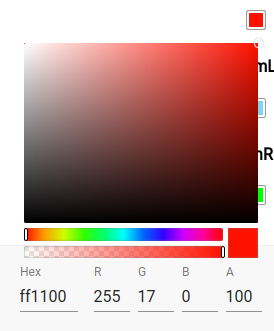
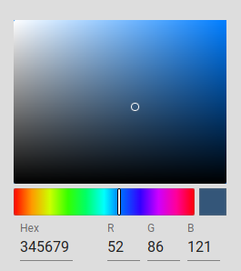

# Material UI Color Picker

Material UI React Color Picker (A fork of [rc-color-picker](https://github.com/react-component/color-picker))

[](https://www.npmjs.org/package/material-ui-rc-color-picker) 
[](https://www.npmjs.org/package/material-ui-rc-color-picker)
[](https://david-dm.org/timmo001/material-ui-rc-color-picker)


## Screenshots




## Features

* Supports color modes RGB, HSB and HSL
* Uses the latest material-ui

## Installation

```bash
yarn add material-ui-rc-color-picker

OR

npm install material-ui-rc-color-picker
```

## Usage

### As a button which toggles the panel in a dropdown

```js
import ColorPicker from 'material-ui-rc-color-picker';
import 'material-ui-rc-color-picker/assets/index.less';

...

<ColorPicker
  className={classes.colorPicker}
  enableAlpha={false}
  color={this.state.color}
  onChange={this.onChange}
  mode="RGB" />
```

### As a panel (No button to show. Shown directly on page)

```js
import { Panel as ColorPickerPanel } from 'material-ui-rc-color-picker';
import 'material-ui-rc-color-picker/assets/index.css';

...

<ColorPickerPanel
  className={classes.colorPicker}
  enableAlpha={false}
  color={this.state.color}
  onChange={this.onChange}
  mode="RGB" />
```

## Avaliable Props

### ColorPicker.props

| name                 | type                                                                      | default                                               | description                                                 |
|:---------------------|:--------------------------------------------------------------------------|:------------------------------------------------------|:------------------------------------------------------------|
| align                | Object: alignConfig of [dom-align](https://github.com/yiminghe/dom-align) |                                                       | popup 's align config                                       |
| alpha                | Number                                                                    | `100`                                                 | opacity of the color                                        |
| animation            | String                                                                    |                                                       | index.css support 'slide-up'                                |
| children             | Node                                                                      | `<span className='react-colorpicker-trigger'></span>` | additional trigger appended to picker                       |
| className            | String                                                                    | ''                                                    | Aditional class to be added to component                    |
| color                | String                                                                    | `#ff0000`                                             | color board current background color                        |
| defaultAlpha         | Number                                                                    | `100`                                                 | opacity of the color                                        |
| defaultColor         | String                                                                    | `#ff0000`                                             | color board current background color                        |
| enableAlpha          | Boolean                                                                   | `true`                                                | enable alpha  controls                                      |
| getCalendarContainer | Function():Element                                                        | `function(){return document.body;}`                   | dom node where picker to be rendered into                   |
| mode                 | String                                                                    | `RGB`                                                 | color mode, support mode 'RGB', 'HSB' or 'HSL'              |
| onChange             | Function                                                                  | noop                                                  | when select color                                           |
| onClose              | Function                                                                  | noop                                                  | when color picker popup close                               |
| onOpen               | Function                                                                  | noop                                                  | when color picker popup open                                |
| placement            | String                                                                    | `topLeft`                                             | one of ['topLeft', 'topRight', 'bottomLeft', 'bottomRight'] |
| transitionName       | String                                                                    |                                                       | css class for animation                                     |


### ColorPicker.Panel.props

| name         | type     | default   | description                                    |
|:-------------|:---------|:----------|:-----------------------------------------------|
| alpha        | Number   | `100`     | opacity of the color                           |
| className    | String   | `''`      | Aditional class to be added to component       |
| color        | String   | `#ff0000` | color board current background color           |
| defaultAlpha | Number   | `100`     | opacity of the color                           |
| defaultColor | String   | `#ff0000` | color board current background color           |
| enableAlpha  | Boolean  | `true`    | enable alpha  controls                         |
| mode         | String   | `RGB`     | color mode, support mode 'RGB', 'HSB' or 'HSL' |
| onBlur       | Function |           | when picker loose focus                        |
| onChange     | Function |           | when select color trigger                      |
| onFocus      | Function |           | when picker focus trigger                      |
| style        | Object   | `{}`      | root node CSS style                            |
